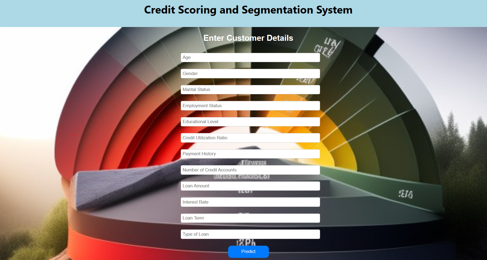
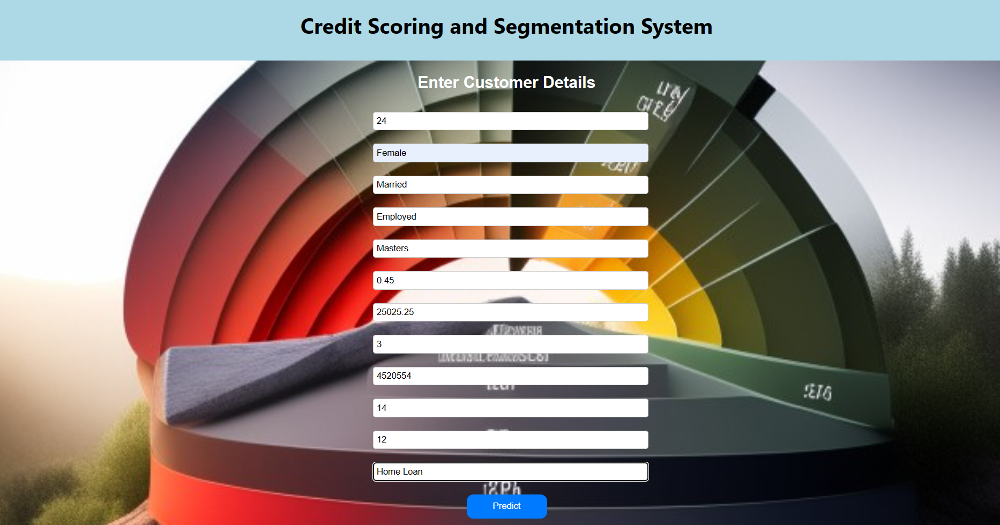

# Credit Scoring and Segmentation

-   [x] Credit scoring is a statistical analysis performed by lenders and financial institutions to access a person's creditworthiness. Lenders use credit scoring, among other things, to decide on whether to extend or deny credit.

-   [x] Credit Segmentation refers to the process of dividing the customers into groups based on their credit behavior. The customers are divided into different segments based on their credit score, credit history, and other factors.

-   [x] The goal of this project is to segment customers into different groups based on their credit behavior.

-   [x] You can access the dataset via this link here https://statso.io/credit-scoring-case-study/ or you can download it from the data folder in this repository.

#### Overview

Credit scoring aims to determine the creditworthiness of individuals based on their credit profiles. By analyzing factors such as payment history, credit utilization ratio, and number of credit accounts, we can assign a credit score to each individual, providing a quantitative measure of their creditworthiness.

The given dataset includes features such as age, gender, marital status, education level, employment status, credit utilization ratio, payment history, number of credit accounts, loan amount, interest rate, loan term, type of loan, and income level.

Your task is to calculate credit scores and segment customers based on their credit scores to gain insights into different customer groups.

#### Run the Setup file to install all the libraries used in this project
 Here's an example of how you can use `pip` to install your package:

1. First, navigate to the directory where your `setup.py` file is located.

2. Run the following command to build a distribution package:

   ```{python}
   python setup.py sdist
   ```

   This will create a `dist` directory containing a `.tar.gz` file that contains your package.

3. Run the following command to install your package using `pip`:

   ```{python}
   pip install dist/credit_system-0.1.tar.gz
   ```

   This will install your package and its dependencies.

After installing the package, you can use the `credit_system` command to run your application. For example, if you have defined a `main()` function in your `manage.py` file, you can run your application using the following command:

```{python}
credit_system manage.py main
```

Install libraries using the requirements.txt file to install all the libraries used in this project.

```{python}
pip install -r requirements.txt
```

#### FICO Formula

let p be payment history

let C be Credit Utilization Ration

let n be Number of Credit Accounts

let el be Education Level

let es be Employment Status

and it can be demonstrated mathematical wise and also in python code:

$$
FICO = (0.35p) + (0.3C) + (0.15n) + (0.1el) + (0.1es)
$$

```{python}
credit_score = (payment_history*0.35) + (credit_utilization_ratio*0.3) + (number_of_credit_accounts*0.15) + (education_level*0.1) + (employment_status*0.1)
credit_scores.append(credit_score)
```

### Description of all features in the data:

1.  Age: represents the age of the customer
2.  Gender: represents gender of the customer
3.  Marital status: represents whether the customer is married or single
4.  Education level: represents the education level of the customer
5.  Employment status: represents whether the customer is employed or unemployed
6.  Credit utilization Ratio: represents the percentage of credit limit that a customer is utilizing
7.  Payment history: represents the payment history of the customer, taking into account factors such as on-time payments, delayed payments, and missed payments.
8.  Number of Credit Accounts: represents the number of credit accounts that a customer has.
9.  Loan Amount: represents the total amount of loan that a customer has taken.
10. Interest Rate: represents the interest rate on the loan.
11. Loan Term: represents the duration of the loan.
12. Type of Loan: represents the type of loan taken by the customer like "Personal Loan", "Home Loan", "Auto Loan", etc.

#### Project Progress

 The workflow is complete currently working on moving the model to django web app 👍.

#### Django Preview:



#### Entering Details:

 \#### The final output of the project

